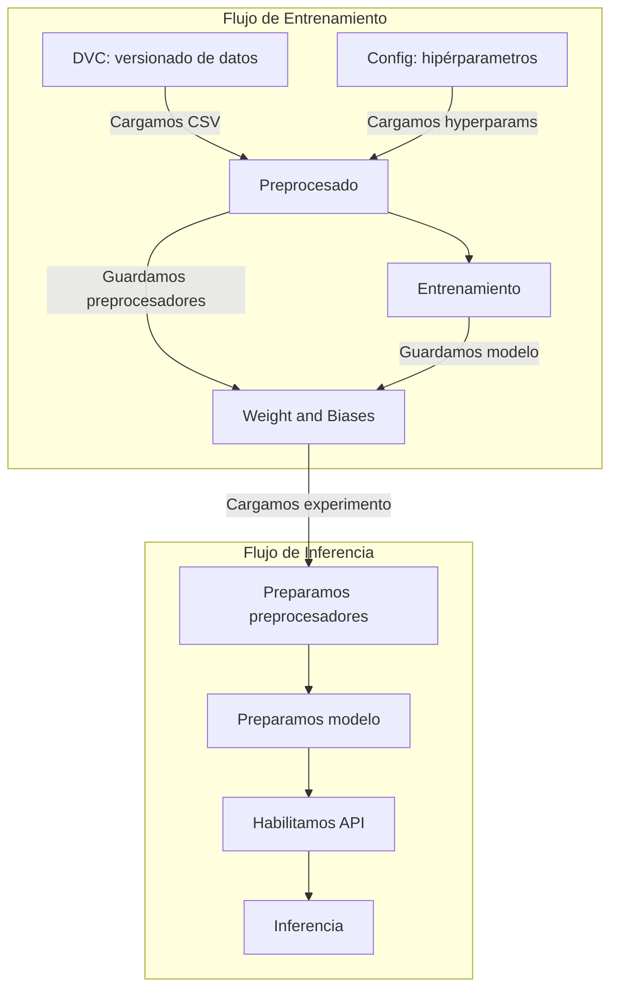

# MLOps Project

El repositorio cubre versionado local de datos, entrenamiento del modelo, inferencia y exposición mediante API para un flujo de predicción meteorológica.

## Instalación

Si quieres probar el proyecto sin leer todo el documento, debes tener instalado `uv` y seguir este orden:

1. Coloca el CSV local en `data/` con el nombre `cleaned_weather.csv`, ajusta `config/hyperparams.yaml` o utiliza el flag `--data_filename` para apuntar a tu dataset
2. Instala dependencias con `uv sync --locked`
3. Lanza el entrenamiento con `uv run python -m src.train.train`
4. Arranca la API con `uv run uvicorn src.api.inference_api:app --reload`

El proyecto utiliza DVC para versionar el dataset localmente. No existe un remoto configurado.

## Estructura del proyecto

```
mlops_project/
├── config/                   # Configuración de entrenamiento y datos
├── data/                     # Ficheros locales del dataset versionados con DVC
├── models/                   # Checkpoints exportados y artefactos entrenados
├── notebooks/                # Notebooks de exploración y experimentación
├── src/
│   ├── train/                # Código de entrenamiento
│   ├── inference/            # Utilidades de inferencia
│   ├── api/                  # Servicio de inferencia con FastAPI
│   ├── logging/              # Configuración del logging
│   └── utils.py              # Funciones utilitarias generales  
└── tests/                    # Test suite
```

## Arquitectura

El flujo general del proyecto es el siguiente:


## Datos y DVC

El nombre por defecto del dataset es `cleaned_weather.csv`. Puedes cambiarlo en `config/hyperparams.yaml` dentro de `data_config.data_filename`, o usar el flag `--data_filename` al lanzar el entrenamiento para apuntar a otro CSV local.

Coloca el CSV dentro de `data/` y versiona el fichero localmente con DVC:

```bash
dvc init
dvc add data/cleaned_weather.csv
```

Para utilizar cargar el dataset de la cache local:
```bash
dvc checkout
```

No hay un remoto de DVC configurado, así que el proyecto usa solo la cache local. La CI debe seguir funcionando sin datos y no debe depender de `dvc pull`.

## Entrenamiento

El entrenamiento está implementado en `src/train/` y lee el dataset desde el CSV local configurado.

Para lanzar el entrenamiento, usa el punto de entrada del proyecto:

```bash
uv run python -m src.train.train
```

También es posible ejecutar el entrenamiento desde Docker, asegurando que los volúmenes con los datos, configuración y modelos estén montados correctamente.
```bash
docker-compose build train
docker-compose run --rm train
```

Los hiperparámetros por defecto están en `config/hyperparams.yaml`, también se pueden pasar como argumentos en la línea de comandos (utilizar `uv run python -m src.train.train --help`). La salida del entrenamiento es el mejor modelo exportado dentro de `models/`.

Todos los parámetros de entrenamiento, preprocesadores y el modelo entrenado se guardan como artefactos en Weights and Biases para facilitar el seguimiento de experimentos e inferencia posterior.

## API/Inferencia

Las utilidades de inferencia viven en `src/inference/` y se encargan de cargar el artefacto entrenado y aplicar el preprocesado necesario.

Para un flujo de predicción local, usa directamente las utilidades de inferencia o arranca la capa de API desde `src/api/`. La aplicación FastAPI expone el modelo para peticiones remotas y reutiliza la misma lógica de carga y preprocesado.

Reporte de Weights and Biases para la selección del modelo: [W&B Report](https://api.wandb.ai/links/eisler-aguilar-universidad-polit-cnica-de-madrid/w9ptf1g7)

Los comandos habituales de desarrollo son:

```bash
uv run uvicorn src.api.inference_api:app --reload
```

Con Docker:
```bash
docker-compose up -d api # Arranca el servicio de inferencia
docker-compose down -v api # Detiene el servicio y borra volúmenes para limpiar artefactos locales
```

El servicio espera que haya un artefacto entrenado disponible en `models/`.

## Pruebas y CI

Antes de abrir un cambio o compartir resultados, valida el repo con:

```bash
uv run pytest
uv run pylint test src
```

Esto ayuda a mantener el proyecto reproducible y alineado con las expectativas de un repositorio bien mantenido en GitHub.
